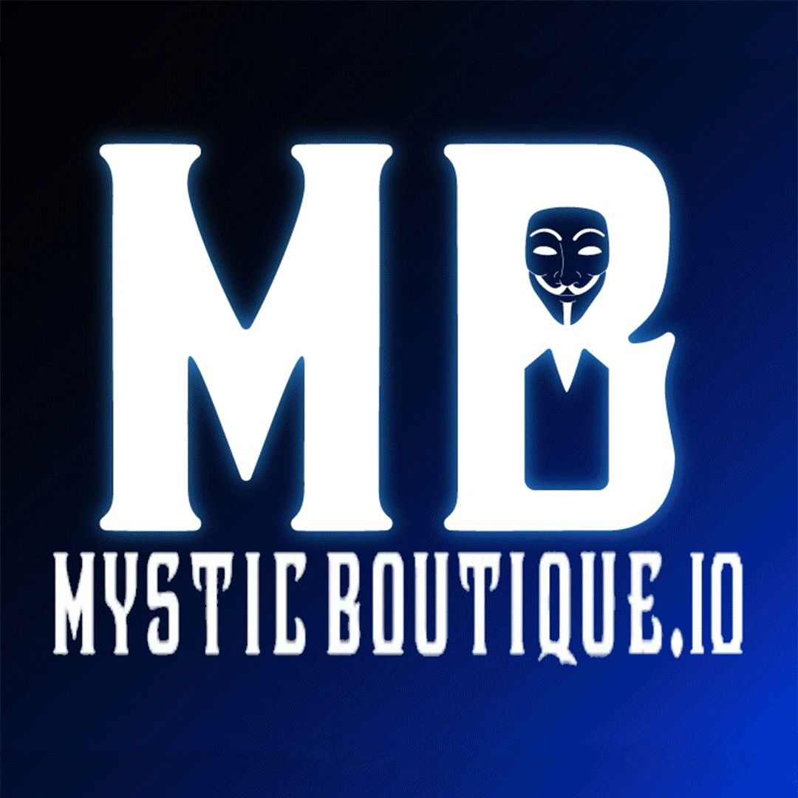

import Bleed from 'nextra-theme-docs/bleed'

# ADANON NFT

Mystic Boutique launched a Cardano NFT series titled, ADANON. 

## Policy ID

**447018304992532ba61d79f9e53c96f65ea241db7de55fc088526bb1**

## About

Why start a DEX with an NFT? What we like most about this strategy was the impact it has with supporting our OG (early) investors. Having an NFT allows our OGs a way to be recognised for their important contribution to the Mystic Boutique ecosystem. The benefits start directly after mint with early access to the mixing service, subsequent exclusive access to a token airdrop, and then continue for life with transaction fee discounts. As long as you hold your Adanon NFT, you will be rewarded. 

The Adanon collection consists of 10 000 shop-styled NFTs with hand-drawn, layered assets. 

There are 4 different rarity tiers which are determined by the overall scene or setting of the shop; Mystic, Blackhole, Bermuda Triangle and El Dorado.

Rarity distribution: To be announced after mint is completed.

Story behind each scene: To be announced after 50% sold

Each NFT has a different combination of aesthetic features which are truly random and only determined at mint. These features are not written in the metadata so as not to be easily identified (remember anonymity is the project focus). 

This provides an additional layer of mystery, because as the mint unfolds so will the ‘rarity’ of the different aesthetic aspect combinations.

## Mint Information

1. [Open a tab at our Minting Dashboard](https://dashboard.mysticboutique.io/mint/)
1. [Open a tab for instructions from our FAQ](/faq/get-started)
1. [Any problems check out our FAQ](/faq/common-problems)

## Secondary Market

[artifct.app](https://artifct.app/collection/StoreAnnouncer)

To facilitate trading the Adanon NFTs the project is verified on [Artifct.io](https://artifct.app). This will allow our users to eventually access our market place Metaverse on the Dark side of the moon. This will be in addition to our native Mystic Boutique marketplace which will provide other exciting and unique market place functionality.

One important point to make from the start, though, is that we will include 0% royalties on future secondary market sales. Royalties do not form a part of our revenue-generation model. 

##  NFT function in Phase 2

During Phase 2 the Adanon NFT will no longer be needed to define the destination wallet as users will manually enter the destination address.

The Adanon NFT will still provide the users a discount for transactions. Currently discounts will be granted per account and the NFT with the largest discount will be favoured. For users to access these discounts the Adanon NFT will need to be staked to Mystic Boutique. 

Every Adanon NFT will receive an equal amount of Mystic Boutique tokens during the airdrop.

Equal distributions of tokens will also be provided for every staked Adanon NFT for each Epoch.

