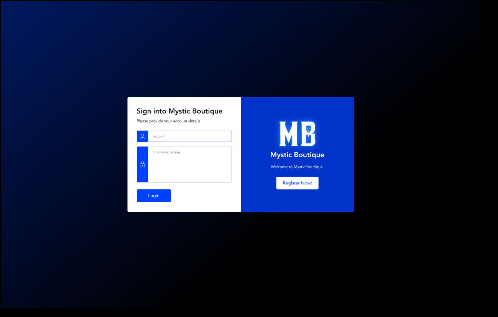
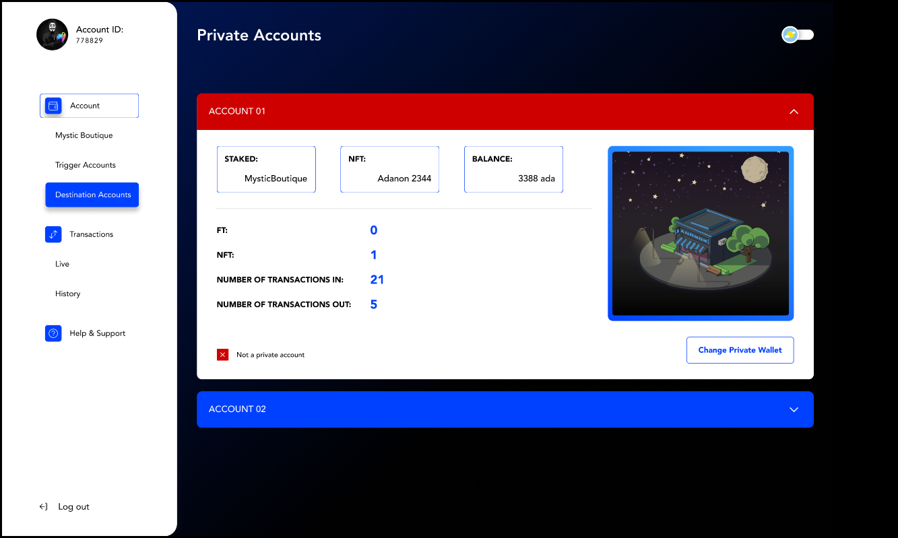
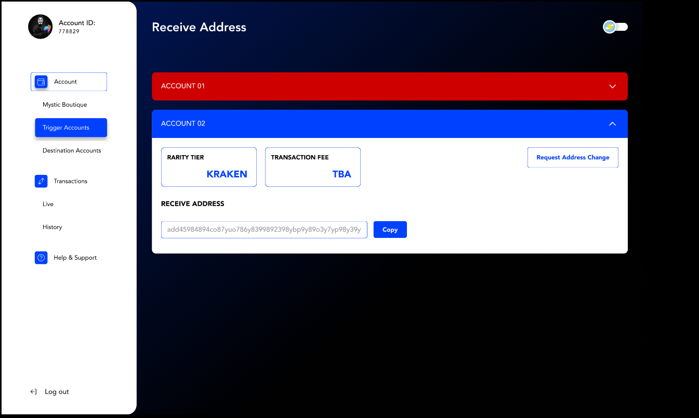
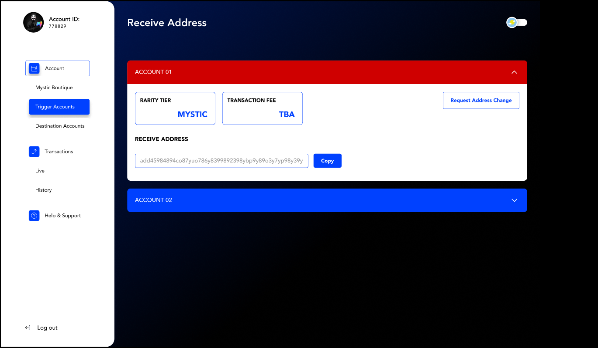
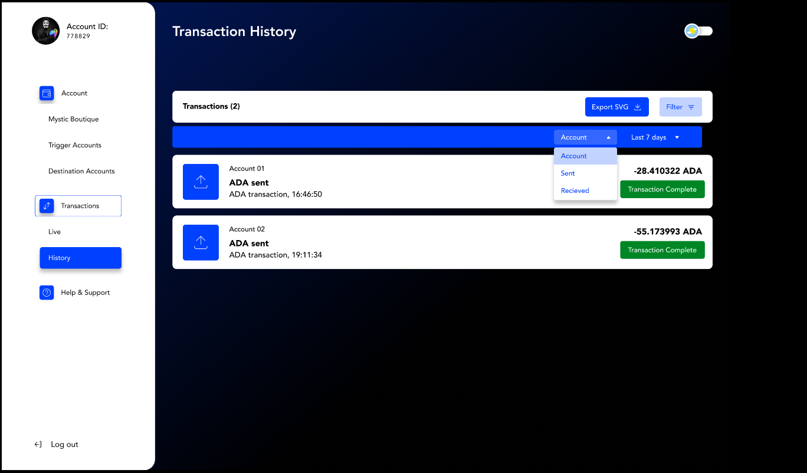

import Bleed from 'nextra-theme-docs/bleed'

# Dashboard Demo

## UI Flow Teaser

<Bleed></Bleed>

<Bleed></Bleed>

<Bleed></Bleed>

<Bleed></Bleed>

<Bleed></Bleed>

<Bleed></Bleed>

<Bleed></Bleed>

<Bleed></Bleed>

