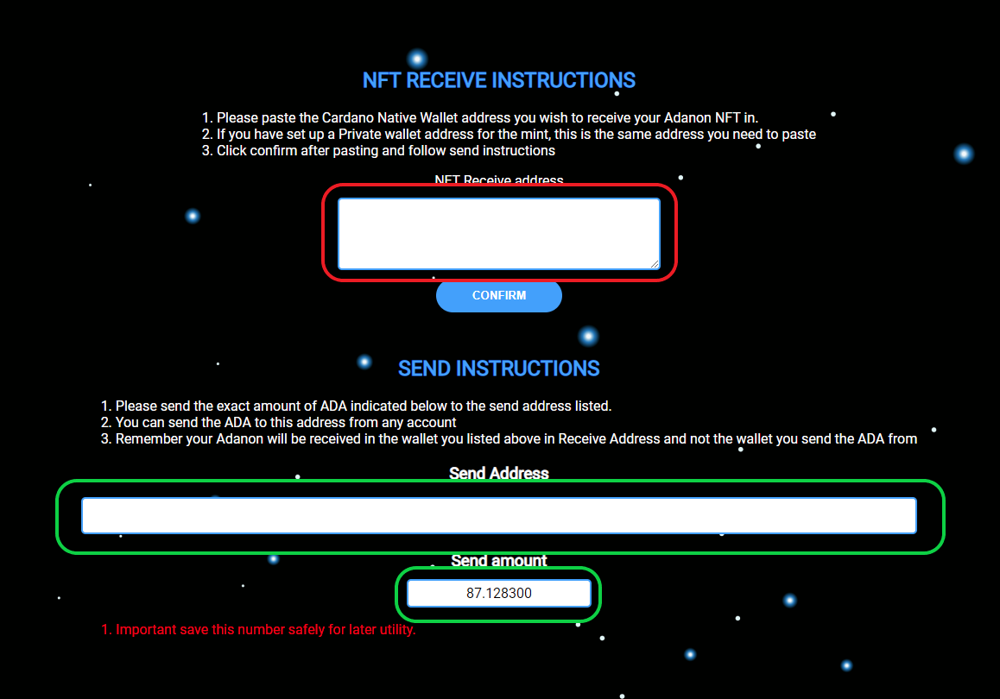

import Bleed from 'nextra-theme-docs/bleed'
import Callout from 'nextra-theme-docs/callout'

# Common Problems and Troubleshooting

This section is designed to help you figure out common problems that you might face when trying to participate in the MB community.

## Minting your Adanon

If you are having issues figuring out the mint then this section should help out.
This is a list of the things you will need to complete this mint successfully.

1. A fresh nami wallet that's never been used before.
1. Another wallet (Yorori, Nami, CCwallet, etc) that contains the funds to pay for your mint.
1. 10-15 mins of time to yourself.

<Bleed></Bleed>

In the above screen shot your **NEVER BEEN USED WALLET GOES INTO THE RED BOX** this is very important don't mess it up.
Once you have confirmed the address your new Adanon will be send to you will be provided a payment address and amount **as shown above in RED** 

