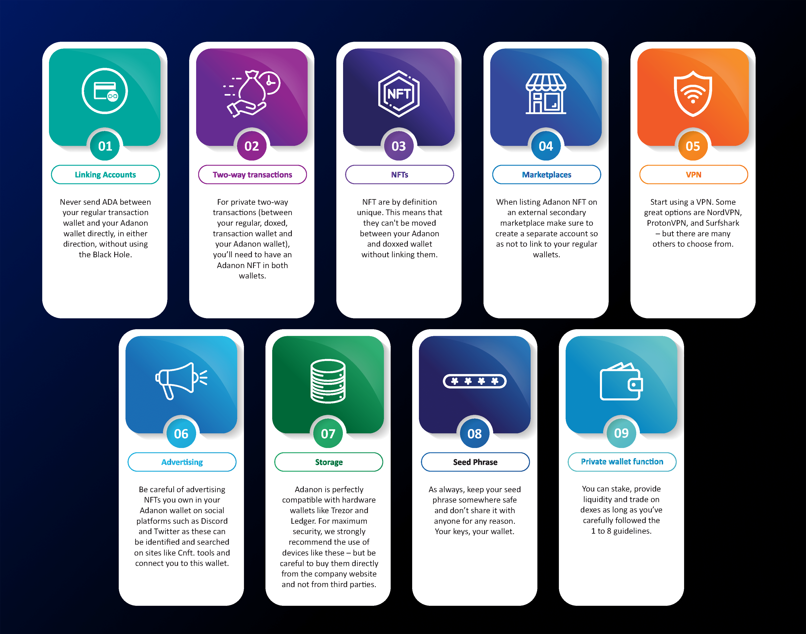
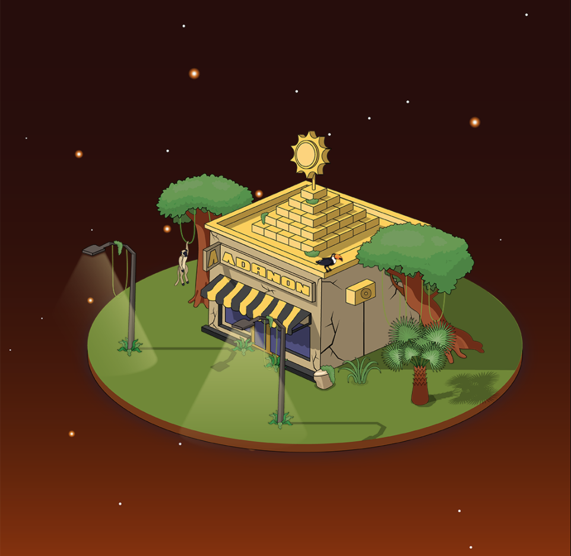
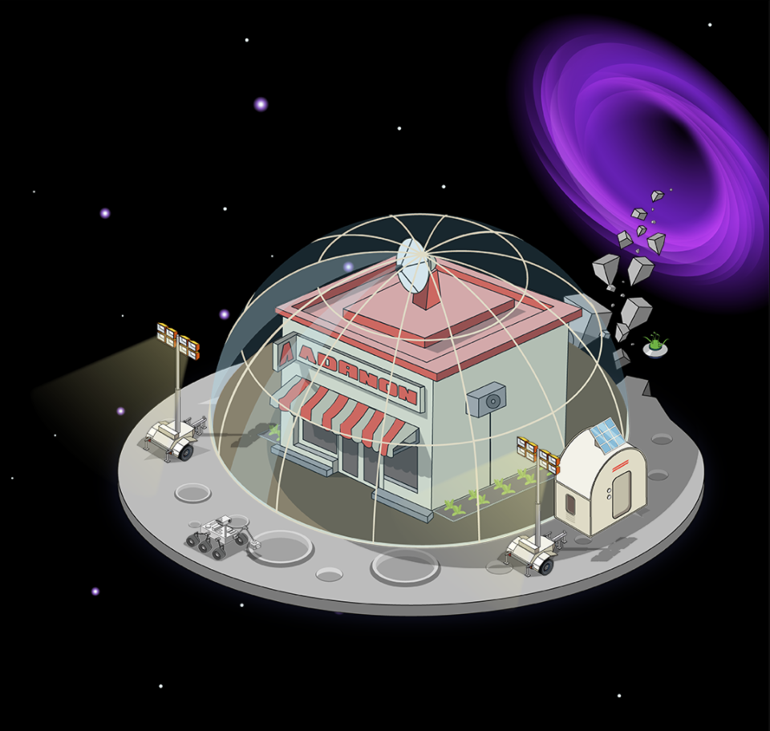
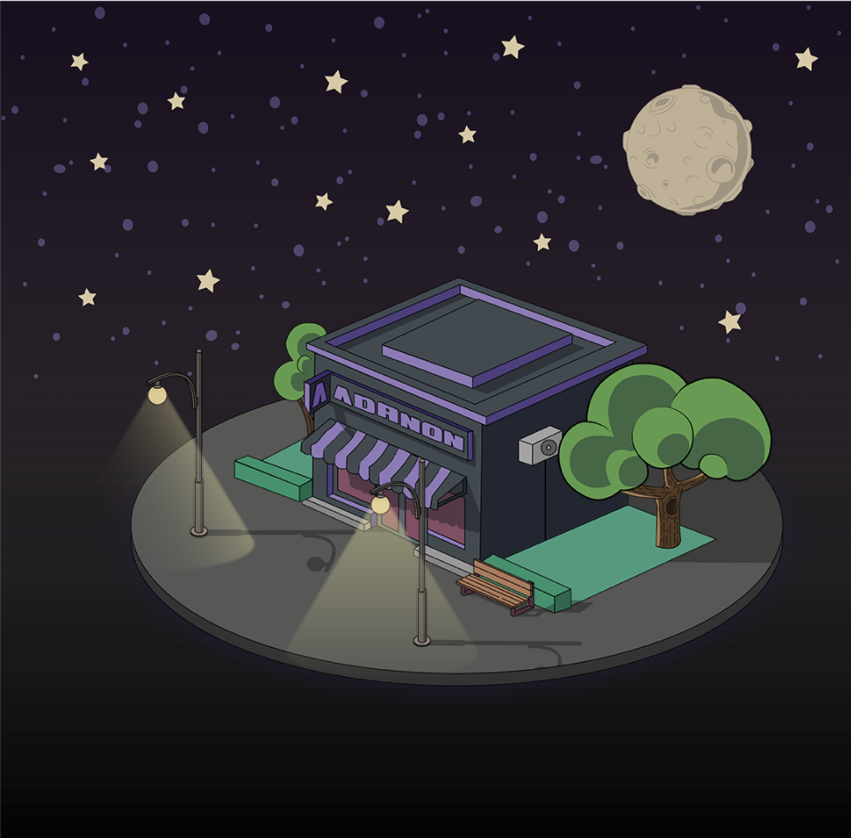
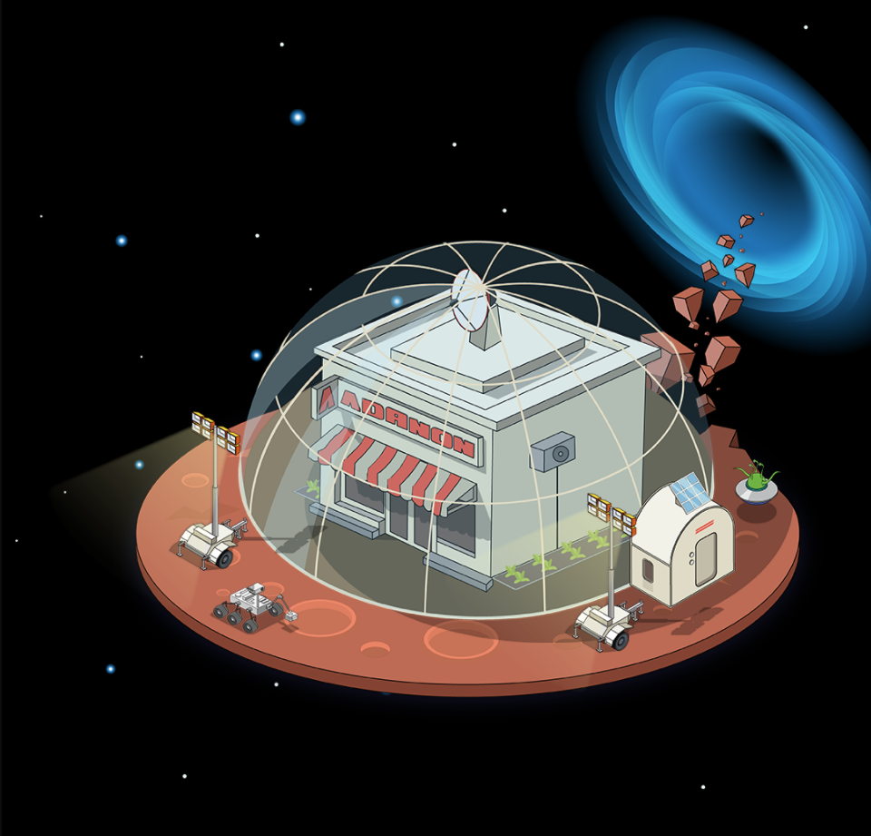
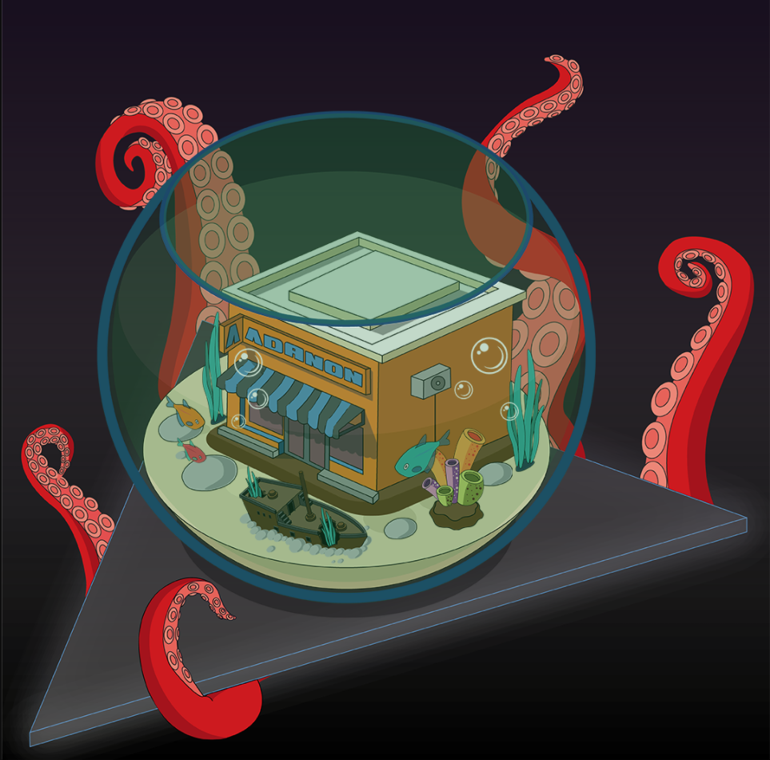
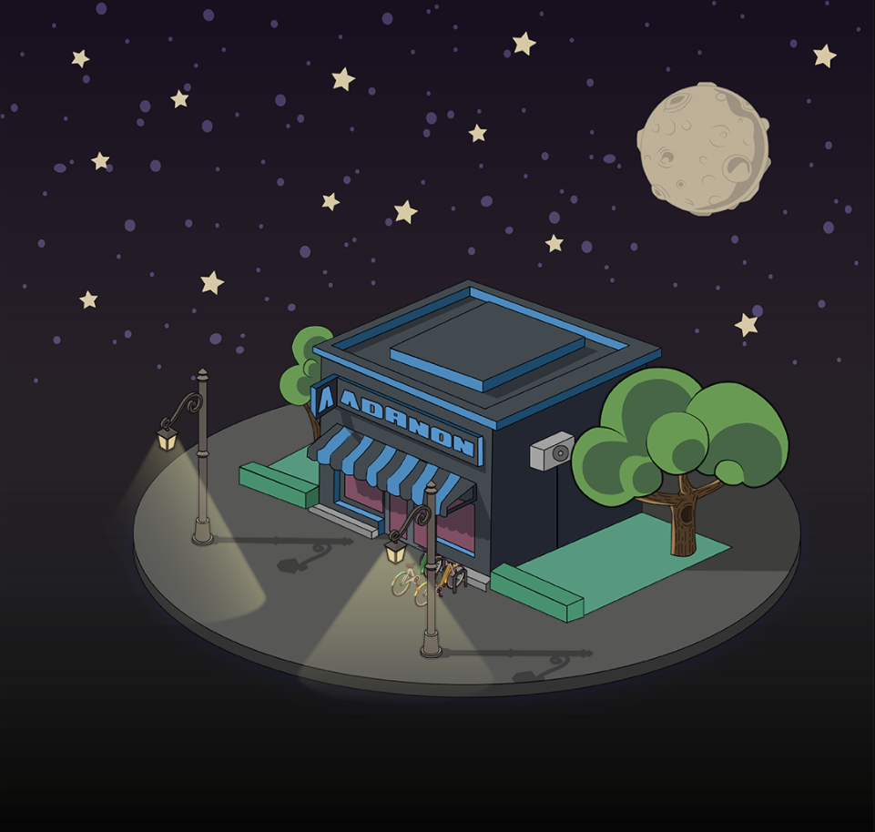
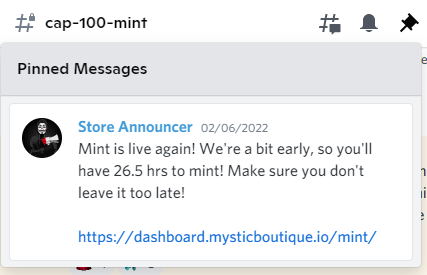
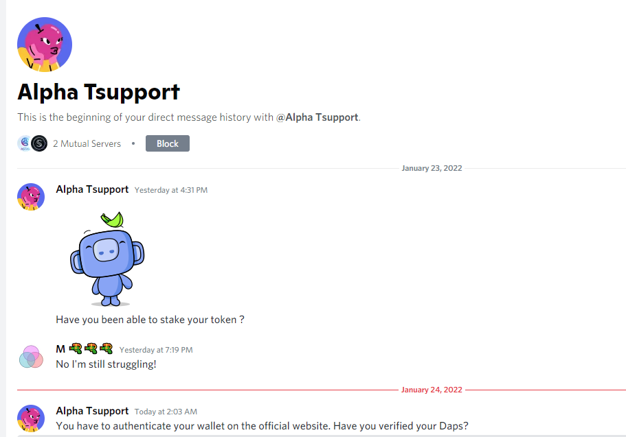

import Bleed from 'nextra-theme-docs/bleed'
import Callout from 'nextra-theme-docs/callout'

# Getting started with Mystic Boutique

Mystic boutique is a utility based NFT collection that allows holders to nominate an account to receive fully private payments. 
We believe it is our users’ right to be able to keep their finances discreet and private if they so choose. We are pro-decentralized finance and inclusive economies.

## OG Collection

A fresh wallet is a critical part of our process, because the connection between this new receive address and your previous transactions and accounts on the Cardano blockchain will be broken, and that’s how our token utility functions to give you privacy and anonymity. 
Fresh wallet means created with new seed phrase! Utility will be activated in phases (please see the road-map ) determined by liquidity levels on our backend. 
We will keep the community updated on these levels as we continue to build and grow. 
ONLY YOU can see and track your transactions on your dashboard. We couldn’t even see them if we wanted to, which is one of the main reasons we’re able to guarantee that your transactions are 100% private and always will be. 

## Best Practices

<Bleed></Bleed>

## Questions

1. **Why do I need a new wallet?** A fresh wallet is a critical part of our process, because the connection between this new receive address and your previous transactions and accounts on the Cardano blockchain will be broken, and that’s how our token utility functions to give you privacy and anonymity. Fresh wallet means created with new seed phrase!
1. **Can I send ADA from an exchange?** No! Please don’t send ADA from an exchange address – your ADA is likely to be lost forever. Please also make sure that the fresh receive address you create is not an exchange wallet. 
1. **What wallet should I use?** We suggest using Nami, Yoroi, Daedalus or ccwallet. 
1. **When will utility be activated?** Utility will be activated in phases (please see the road-map ) determined by liquidity levels on our backend. We will keep the community updated on these levels as we continue to build and grow. 
1. **Can I sell my NFT?** Yes. Our NFTs – and the utility that goes with them – are fully transferrable. More on the transfer process to come. 
1. **How private are these transactions if I can see them?** ONLY YOU can see and track your transactions on your dashboard. We couldn’t even see them if we wanted to, which is one of the main reasons we’re able to guarantee that your transactions are 100% private and always will be. 
1. **Why are you breaking up the drop into stages / CAPS?** We’ve chosen to release our NFTs this way to avoid congestion, minimize strain on our systems, and to guarantee fair distribution. Botting and parallelization are just not possible under our staggered, whitelist-based drop system. 
1. **How will the drops actually work?** Please see our website (www.mysticboutique.io) and #how-to-mint for drop details in our discord.
1. **Can I buy more than one NFT?** Yes. You can buy as many as you like.
1. **Where can I find out more about the project?** See our website and follow us on Twitter 
1. **What happens to the data I submit for whitelist registration?** We do not, nor will we ever, store any data related to our community wallets or receive addresses. The information we use to coordinate our NFT drop process will be deleted immediately following completion of the drop. It is critical to our project security that we do not hold any of our users’ information.
1. **What will each Adanon NFT cost?** Our project is a full utility project whereby we don't just want to provide the promise of utility in the future, we want to deliver immediately after mint. For this to happen and for the upper limit per transaction to be practical, we will be channeling the revenue after costs of the 87 ADA mint to Mystic Boutique liquidity. This not only provides better utility (sooner and higher single transactions allowance) but also automatically assigns value benefit to our OG NFT holders with amazing transaction benefits.
1. **How do I create a new wallet and sign up for the Whitelist?** [We've created a handy demo video on how to do all of this.](../../public/cap-demo2.mp4)

## Collection Pull Examples

<Bleed></Bleed>

<Bleed></Bleed>

<Bleed></Bleed>

<Bleed></Bleed>

<Bleed></Bleed>

<Bleed></Bleed>

## Cap100

Cap100 the real OG's of the Adanon scene. These legends have been around since the beginning of time, or at least our discord. 
When this project started it was clear that it would be a game changer for anonimity on Cardano and with that in mind we wanted to grow slowly and organicly.
With this in mind we started inviting members of the community that we knew could help. From there we asked for them to invite other members they believed would be a good fit.
Fast forward a few weeks and we successfully filled the entire Cap100 mint round. Thanks to all your Adanon OG's who participated in Cap100. You will forever be legends for helping us get this started.

<Callout type="warning" emoji="⚠️">
  **Cap100 OG's Baby** 
</Callout>

<Bleed></Bleed>

## Cap2

Cap2 is name of the second group of community members open for minting. This group consists of other members eager to participate that missed cap100. 

<Callout type="warning" emoji="⚠️">
  **Cap2 Where you at?**
</Callout>

<Bleed></Bleed>

## Cap3

Cap3 is name of the third group of community members open for minting. This group consists of other members eager to participate that missed cap100 and Cap2. 

<Callout type="warning" emoji="⚠️">
  **Cap3 Where you at?**
</Callout>

<Bleed></Bleed>

## Cap4

Cap4 from now on it's open mint with batch of 1000. Users will be prompted to create a new wallet if our system picks up that they are minting with a used wallet.

## Scammers

<Callout type="error" emoji="🚫">
 Please keep in mind, no admin will DM you first, you should DM admin, and be cautious if someone DM you offering help, take screenshots as evidence and report the scammers. Let's work together to build a great community here!
</Callout>

Below is an example of the type of message you might get from a scammer. Please stay sharp!

<Bleed></Bleed>
