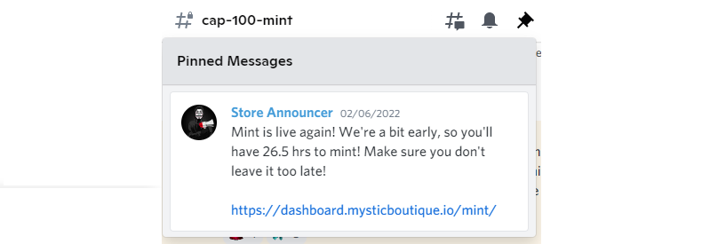

import Bleed from 'nextra-theme-docs/bleed'
import Callout from 'nextra-theme-docs/callout'

# Getting started with Mystic Boutique

Mystic boutique is a utility based NFT collection that allows holders to nominate an account to receive fully private payments. 
We believe it is our users’ right to be able to keep their finances discreet and private if they so choose. We are pro-decentralized finance and inclusive economies.

## OG Collection

The original part of the collection. Each human has a salary and their salary determins the nubmer of HOTM they earn each day during the first year of HOTM generation. 
HOTM is an erc-20 token that is earned by all generation 1 humans through a process of lazy staking. This means after buying a human there is nothing your lazy ass needs to do to start generating HOTM. 

## Cap100

<Callout type="warning" emoji="⚠️">
  **Cap100 OG's Baby** 
</Callout>

<Bleed></Bleed>

## Cap200

<Callout type="warning" emoji="⚠️">
  **Cap200 Where you at?**
</Callout>

<Bleed></Bleed>

## Scammers

<Callout type="error" emoji="🚫">
 Please keep in mind, no admin will DM you first, you should DM admin, and be cautious if someone DM you offering help, take screenshots as evidence and report the scammers. Let's work together to build a great community here!
</Callout>

Below is an example of the type of message you might get from a scammer. Please stay sharp!

<Bleed></Bleed>
