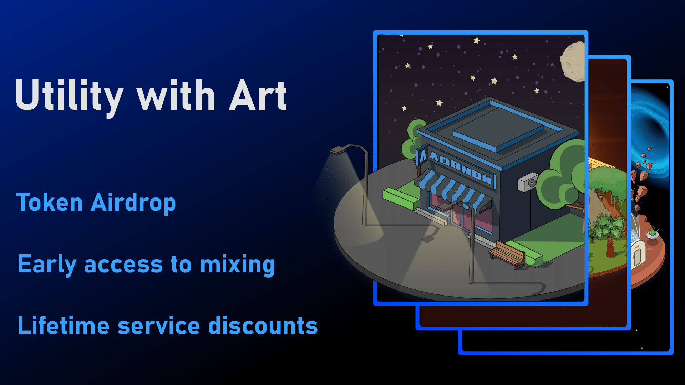
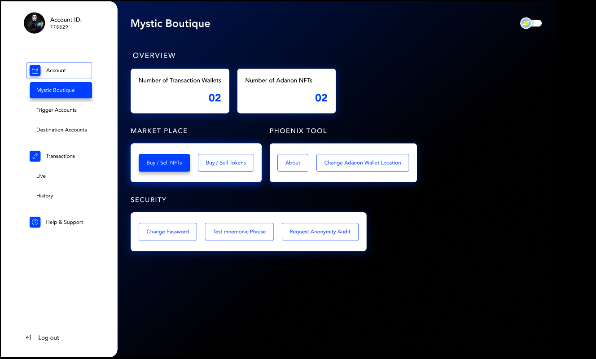
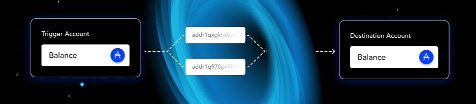
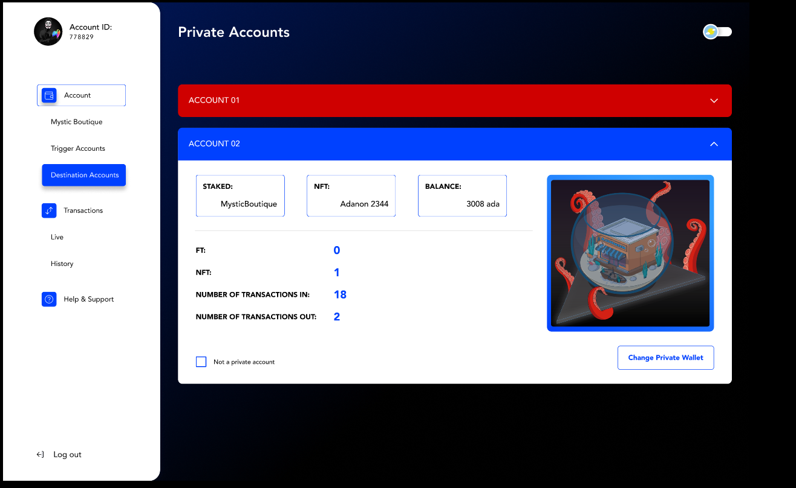
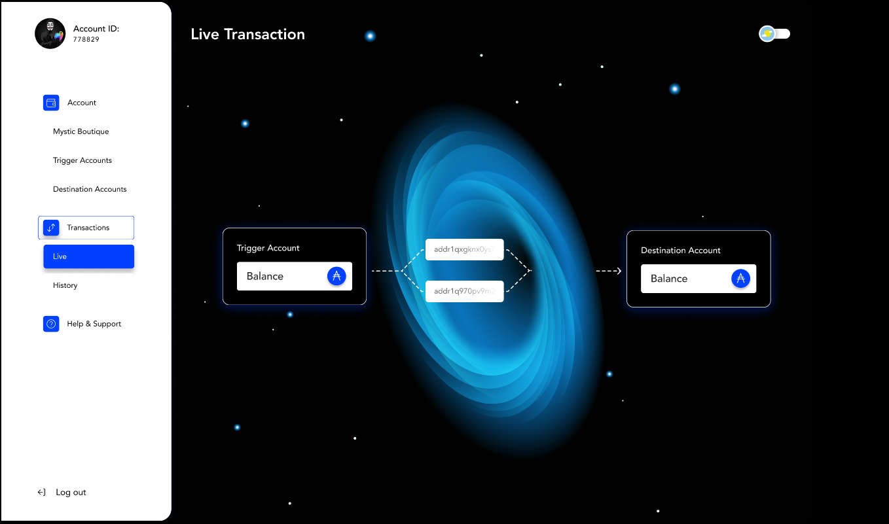

import Bleed from 'nextra-theme-docs/bleed'

# Mystic Boutique - White Paper

Mystic Boutique is a private transaction-based decentralized exchange. 
Mystic Boutique will allow users to access mixers, swap tokens, provide liquidity and access a dynamic NFT marketplace.

<Bleed></Bleed>

Mystic Boutique has two main disruptive and innovative aspects of the service: 

1. **cross-blockchain interoperability**
1. **fully private transactions for all utility functions.**

The process for these key functions is managed using a blockchain-based management system. 
Our dashboard allows our holders to send and receive crypto fully anonymized, while having a private view of their own transactions through our dashboard. Our NFT allows OG investors early access to mixer, lifetime service discounts and token airdrop.
‍
## Terminology

1. **Doxxed wallet** – A wallet which has been linked to a marketplace by a personal email address or is discoverable through a history of sharing receive address or NFTs on social networks such as twitter and Discord, or is linked by transactions to a KYCed exchange account.
1. **OG** - An OG is an early member of The Mystic Boutique community. CAP100 members are OG Adanon NFT holders and our Adanon NFT holders are OG Mystic Boutique members. 
1. **MB System** - Is the codebase that manages the mixing service. 
1. **Black Hole** - Is the term used to easily describe our mixing service. Ada is sent in and randomly divided smaller amounts are then sent out the other end from our liquidity accounts to a predetermined user-linked wallet that the user retains full control of.
1. **Liquidity account** - A wallet owned by the Mystic Boutique system that automatically executes code to fill transaction events.
1. **Trigger wallet** - A trigger wallet is generated and linked to a user’s Adanon NFT (Phase1) or Mystic Boutique account (Phase2+). It is owned by the MB System and when Ada is sent to the receive address of a trigger account, the MB System sends Ada to the linked wallet holding the Adanon NFT (Phase 1) or the user-defined wallet address (Phase 2+) from randomly selected liquidity accounts (see above).
1. **Destination wallet** - This is the wallet that you want ADA to be sent to after it has gone through the Black Hole. We recommend having at least one wallet that is not linked to your other wallets through transactions. This will result in the wallet being completely anonymous. In Phase 1 this wallet is determined by the wallet that holds your NFT. In Phase 2 this is determined by the address you enter in the dashboard during the transaction process. 
1. **Privacy vs Anonymity** - Privacy is defined as ‘a state in which one is not observed or disturbed by other people’ or ‘the state of being free from public attention.’ Anonymity on the other hand conveys a sense of facelessness, where one may be observed, but any observation stops short of identification. Our system is private in the sense that the dashboard that allows users to interface with the Black Hole is not observable at all by outsiders - or even by the MB team- and is therefore (along with transaction histories and user data) truly private. It also results in the creation of a wallet that provides anonymity in terms of the above definition in the sense that the wallet, like all wallets on public blockchains, is observable and its contents discoverable, but, if the system is used correctly and best practices adhered to, is impossible to connect to any individual or user identity.

## Utility - Phase 1

### Mixing Service

The Mystic Boutique mixing service is a unique and exciting concept for mixing as it provides: 

1. instant private transactions with no lock-up period or time-delay
1. publishable receive (trigger) addresses, a bit like a receive handle that doesn’t tie your identity to a particular wallet
1. a simple, streamlined and efficient process
1. any amount of ADA **determined by liquidity threshold.**

The system is designed around liquidity accounts that interact with each other as well as destination accounts and all these fully automated transactions are bundled to maximise efficiency, minimise network load, and further obfuscate transactions.

To access this service, user must sign up with a non-custodial Mystic Boutique account (protecting their privacy and granting them full control). Every Mystic Boutique account sign up will auto-generate a new linked trigger account. The trigger account will be the receive address used to activate the mixing of user ADA. Any ADA sent to this wallet, no matter where from, will result in the same amount sent to your destination account in randomly generated smaller amounts, from randomly selected liquidity accounts. What that means is users can receive ADA from others and themselves all while enjoying complete anonymity, privacy and control. 

Importantly, the ADA sent to the linked (receive) wallet will never be the same ADA sent to your Destination wallet.

### Mixing Service Fees

The fees for the mixing service will start at 1% for the first phase of liquidity. This will decrease as the liquidity and transaction throughput increases. Fees are required to provide system support as well as benefits to liquidity providers and node operators. Holders of the 10,000 Adanon NFT series will enjoy discounts on this base fee determined by the rarity tier of their NFTs for as long as they hold the NFT.

### Phase 1 Utility

The initial phase 1 utility is purely a mixing service and is designed to benefit our NFT holders with early access. At this early stage the user will make use of a receive account linked to their minted NFT. The NFT will act as the marker for their destination account. For this reason, we suggest that buyers of our NFTs refrain from advertising the NFT in their destination wallet if they want to maintain its anonymity. There are use-cases (two-way use of the black hole, for example), where a user may want to have an NFT in their regular transaction account, and these NFTs can be freely shared as there is no need in this instance to preserve the anonymity of the wallet. 

A user will be able to send or have ADA sent to their defined receive account (linked account). The ADA will run through the same process as described above, with the only difference being, the wallet that holds their NFT is the wallet that will receive the ADA from the mixer.

<Bleed></Bleed>

### Phoenix Tool

The Phoenix tool is an Adanon burning tool. This tool will only be available while the policy ID is open. The purpose of this tool is to allow our users the option to burn and re-mint their Adanon NFT and retain the utility in case of:

1. Secondary market purchase. Purchasing an Adanon NFT on a secondary market other than the Mystic Boutique marketplace would compromise the utility as the NFT most likely will be sent to your doxed wallet (wallet with a linked email address, liked to socials or linked by transactions to an KYCed exchange)
1. Re-establishing a private wallet. We are all human and there is a high likelihood that you might compromise your private wallet in some way. For this reason, we provide the Phoenix tool so our users can burn their old NFT and receive a New Adanon NFT with the same rarity in a new private wallet. 

<Bleed></Bleed>

## Utility - Phase 2

Phase 2 is the public launch of Mystic Boutique and will include a:

1. Dashboard
1. Independent private blockchain based management system
1. Fully private Marketplace/trading post

<Bleed></Bleed>

### Dashboard

The Dashboard will be the heart of Mystic Boutique. Users will access their dashboard with their non-custodial Mystic Boutique account.

The dashboard will allow users to:

1. Manage mixing by defining the destination account, changing receive addresses
1. View their mixed transactions in real time
1. Check and download transaction history 
1. Access the Phoenix NFT tool
1. Access Mystic Boutique marketplace
1. View and manage Adanon NFTs
1. Manage staking and liquidity
1. Request anonymity audits

<Bleed></Bleed>

## Utility - Phase 3

Detail coming soon. Teaser: DEX and cross chain functionality 

<Bleed></Bleed>

