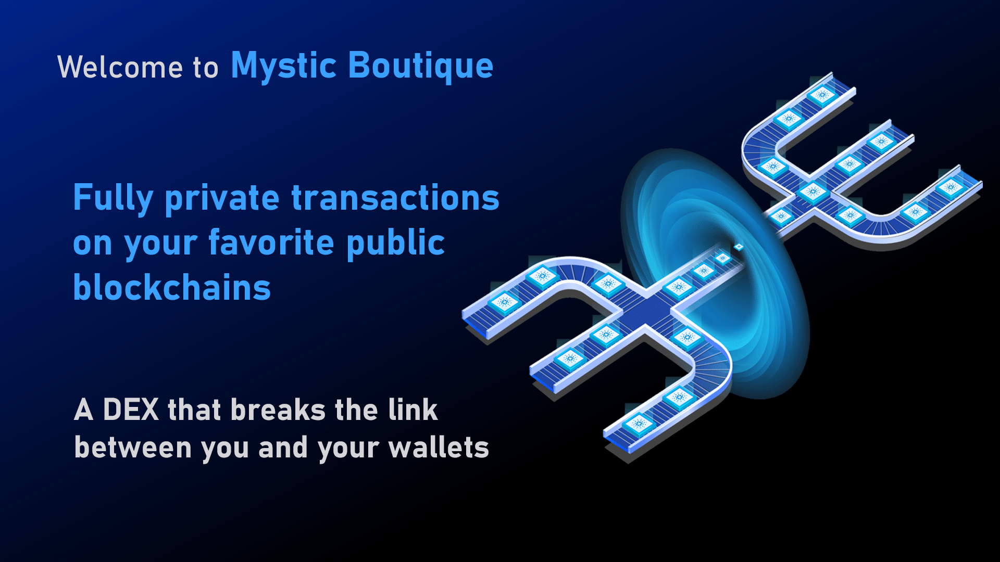

import Bleed from 'nextra-theme-docs/bleed'

# Mystic Minter

## Mystic Minter

The Adanon NFT drop required a lot of firsts for NFT minting on Cardano. Our team was up for the challenge and developed the Mystic Minter. 

Some unique features which separate this minter from others are: 

1. Minters are able mint privately
1. Minters can receive the NFT to a specified native wallet address
1. Minters can send Ada from an exchange if your NFT receive address is native
1. Live wallet validation

An additional feature that is available but not required for Adanon is a One Time Pin (OTP) generation for secure minting.

## Rental 

We have had several enquiries for the use of our minting machine, so we decided to make the Mystic Minter available to our community for minting other projects. We are working to assist a few projects on their minting process in Q2. 

## Infrastructure and Code

Details coming soon

Teaser: Will be fully decentralised and private with blockchain based management including smart contracts. All code that won’t compromise security and privacy will be made open source.   

## Partnerships

To be announced:

Teaser: : Categories include Blockchain, Tokens, Retail, SoFi, NFT Projects

<Bleed></Bleed>

